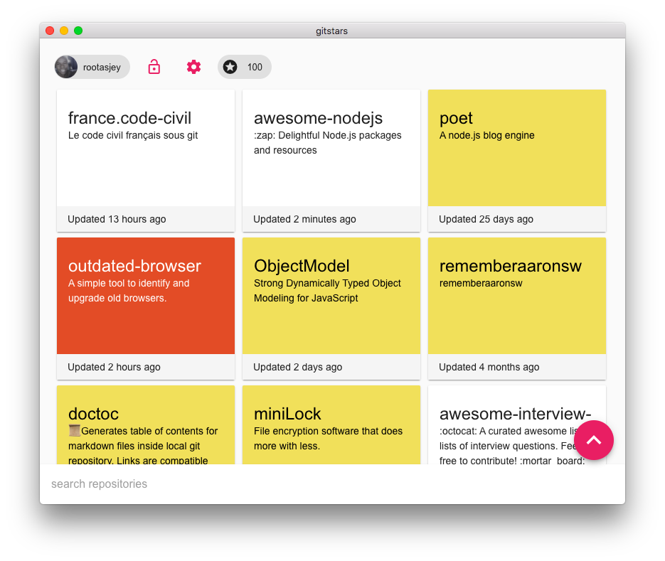
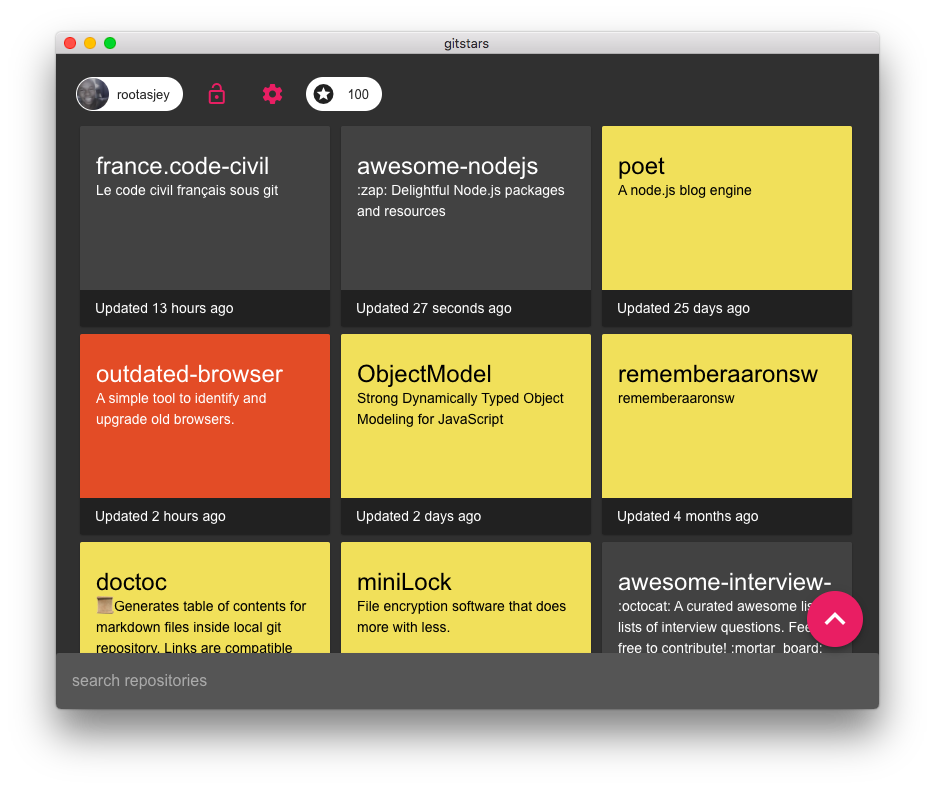
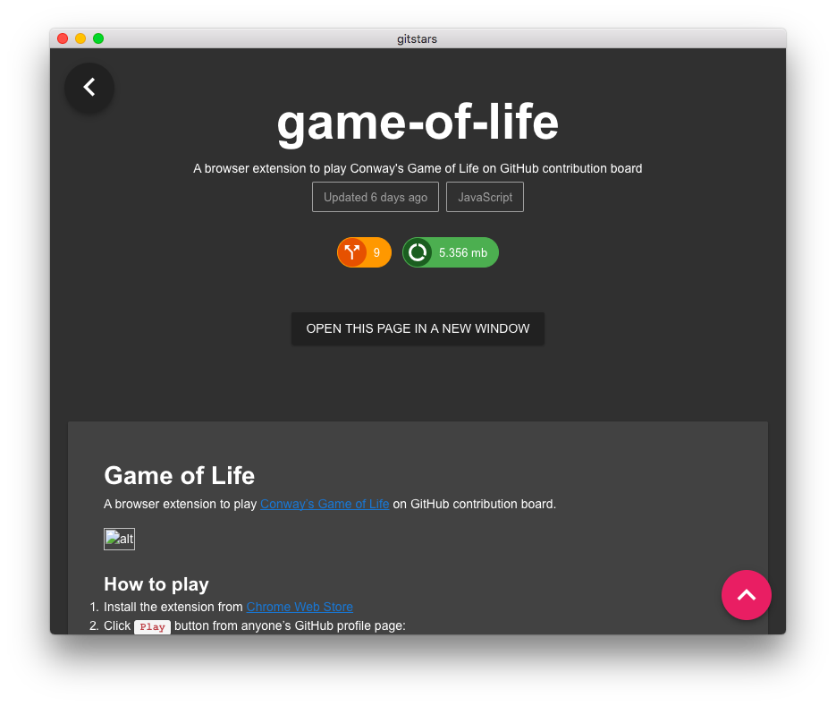

#  Gitstars

A minimalist electron app to vizualize your GitHub starred repositories.

## Why ?

* Visualize your starred repos in a cards layout
* Fast UI
* Keep your starred repos open
* _(personal)_ Learn about graph-ql client-side
* _(personal)_ I wanted to play with Vue and Electron

## Latest update

* Add app's menu

## Screenshots





## Downloads

Only macOS build is available for now. You're welcome to build the app for your own platform and then send me a pull request :)

* [Latest macOS build](https://github.com/rootasjey/gitstars/releases)

## Contributing

#### Build setup

Folow these steps to develop gitstars

``` bash
# with yarn

# clone the repo to your local env
git clone https://github.com/rootasjey/gitstars.git

# install dependencies
yarn

# serve with hot reload at localhost:9080
yarn run dev

# build electron application for production
yarn run build

# run unit tests
yarn run test

# lint all JS/Vue component files in `src/`
yarn run lint
````

``` bash
# with npm

# clone the repo to your local env
git clone https://github.com/rootasjey/gitstars.git

# install dependencies
npm install

# serve with hot reload at localhost:9080
npm run dev

# build electron application for production
npm run build

# run unit tests
npm test


# lint all JS/Vue component files in `src/`
npm run lint
```

## Librairies

This app uses:

* [electron-vue](https://github.com/SimulatedGREG/electron-vue)
* [GitHub graph-ql API](https://developer.github.com/v4/)
* [vue-apollo](https://github.com/akryum/vue-apollo)
* [vuetify](http://vuetifyjs.com)
* [showdown](https://github.com/showdownjs/showdown)

## Credits

<div>Icons made by <a href="http://www.freepik.com" title="Freepik">Freepik</a> from <a href="https://www.flaticon.com/" title="Flaticon">www.flaticon.com</a> is licensed by <a href="http://creativecommons.org/licenses/by/3.0/" title="Creative Commons BY 3.0" target="_blank">CC 3.0 BY</a></div>
